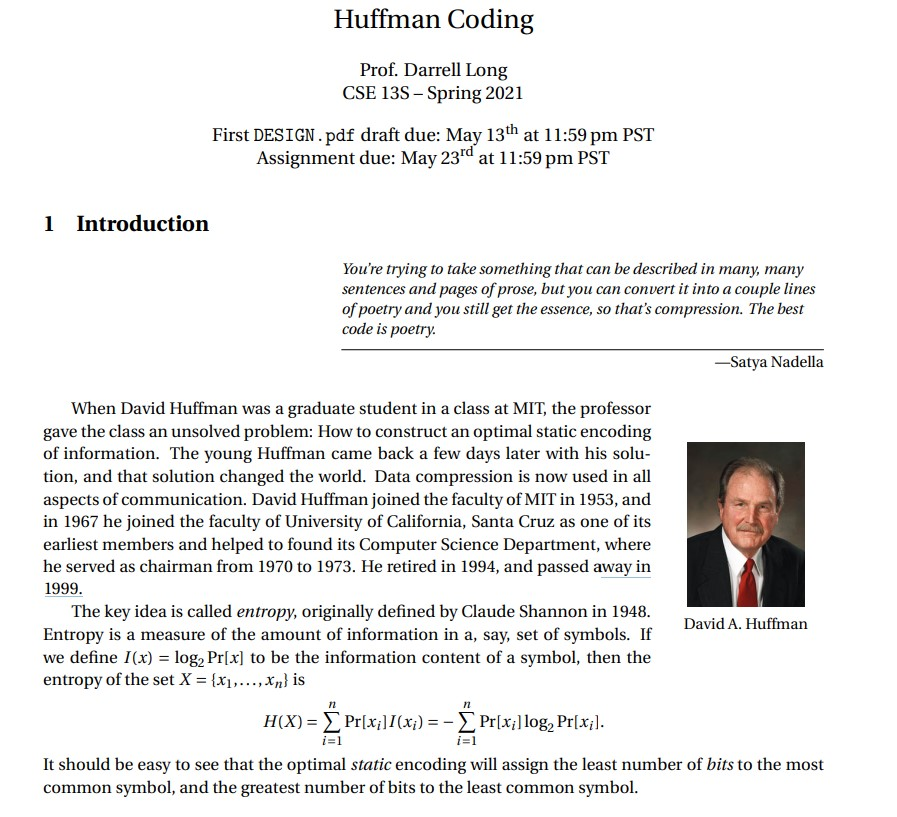
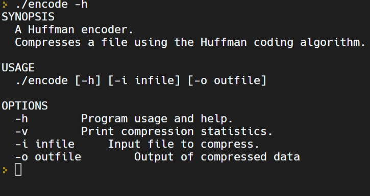
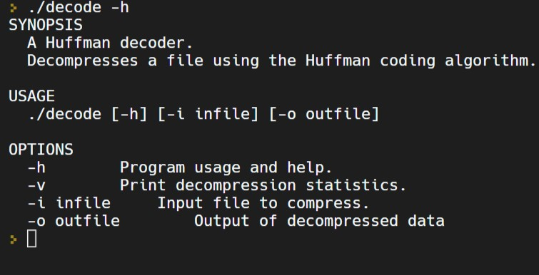
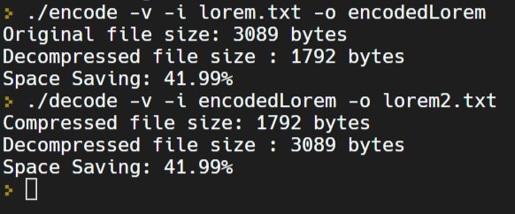

# Huffman Encoding and Decoding in C

This repository contains an implementation of the Huffman encoding and decoding algorithms in C for an Assignment I've done at University of California, Santa Cruz. Huffman encoding is a widely used lossless data compression algorithm that is optimal for compressing data with a known probability distribution. The algorithm works by assigning shorter binary codes to more frequently occurring characters, resulting in efficient compression.

## Features

- Lossless static compression using Huffman trees
- Dynamically generated Huffman tree
- Efficient binary representation
- Header containing a secret value for validation
- Easy-to-use command line interface
- Statistics output option
- File explanations provided

## Prerequisites

To build and run this project, you need to have the following installed on your machine:

- C compiler (e.g., GCC or Clang)
- Make (optional)

## Repository Structure

1. Makefile
2. encode.c
3. decode.c
4. entropy.c
5. defines.h
6. node.h
7. node.c
8. pq.h
9. pq.c
10. code.h
11. code.c
12. io.h
13. io.c
14. stack.h
15. stack.c
16. huffman.h
17. huffman.c
18. DESIGN.pdf
19. README.md (this)

## Build Instructions

1. Clone the repository:
```sh
git clone git@github.com:pajsimbulan/huffman.git
```

2. Change into the project directory:
```sh
cd huffman
```

3. Compile the source files:
```sh
make
```

## Usage

### Encoding

To use the Huffman encoding program, run the following command:
```sh
./encode -v -h -i <input_file> -o <output_file>
```

Replace `<input_file>` with the path to the file you want to compress and `<output_file>` with the path where you want the compressed result to be saved. The `-v` flag prints the statistics when encoding a file, and the `-h` flag prints usage instructions and exits the program. If the input or output file is not supplied, stdin is used for input and stdout for output.

### Decoding

To use the Huffman decoding program, run the following command:
```sh
./decode -v -h -i <input_file> -o <output_file>
```

Replace `<input_file>` with the path to the compressed file you want to decompress and `<output_file>` with the path where you want the decompressed result to be saved. The `-v` flag prints the statistics when decoding a file, and the `-h` flag prints usage instructions and exits the program. If the input or output file is not supplied, stdin is used for input and stdout for output.

### Additional Commands

- `make clean`: Removes all the binary files and .o files that were built.
- `make scan-build`: Runs a memory leak test.
- `make format`: Formats the .c and .h files.

## Contributing

Contributions are welcome! Please feel free to submit pull requests or create issues to report bugs or suggest improvements.
<br /><br />

# Screenshots 

### **Introduction**

<br /><br />

### **Encoding Instructions**

<br /><br />

### **Decoding Instructions**

<br /><br />

### **Huffman Encoding + Decoding Results**

<br /><br />

# License
This project is open-source and available under the MIT License.
